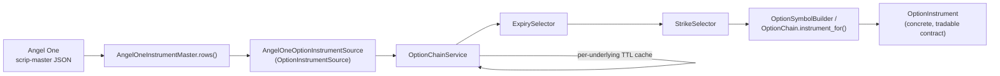

# Options Trading Infrastructure — Phase 1

## Scope

Phase 1 adds the plumbing needed to resolve a concrete, tradable option
instrument for a configured underlying: fetch an option chain from a
broker, cache it, pick an expiry, pick a strike, and build/verify the
resulting trading symbol. **It is infrastructure only** — no order is
ever placed by this code, nothing here is wired into an API router or
the dashboard, and no existing behavior (Signal API, Paper Trading, Auto
Trading orchestrator, risk management) changes. `Settings.trading_mode`
is reserved for a future phase and is not read anywhere yet.

## Architecture



`OptionChainService` is the only component that talks to a broker (via
the `OptionInstrumentSource` protocol). Everything downstream of it
(`ExpirySelector`, `StrikeSelector`, `OptionSymbolBuilder`) is pure,
broker-agnostic logic that operates on plain `date`/`float` values and
the dataclasses in `app.options.models`.

## Folder structure

```
app/options/
    __init__.py                package docstring
    models.py                  OptionType, StrikeMode, ExpiryMode,
                                OptionInstrument, OptionChain
    exceptions.py               OptionsError hierarchy
    option_symbol_builder.py    OptionSymbolBuilder
    expiry_selector.py          ExpirySelector
    strike_selector.py          StrikeSelector
    option_chain_service.py     OptionInstrumentSource protocol,
                                AngelOneOptionInstrumentSource,
                                OptionChainService, get_option_chain_service
    schemas.py                  Pydantic DTOs (unused by any router this phase)

tests/unit/options/
    test_models.py
    test_option_symbol_builder.py
    test_expiry_selector.py
    test_strike_selector.py
    test_option_chain_service.py
```

## Class responsibilities

- **`OptionInstrument` / `OptionChain`** (`models.py`) — framework-agnostic,
  immutable domain data. `OptionChain` exposes `expiries()`,
  `strikes_for_expiry()`, and `instrument_for()` as read-only helpers over
  its instrument tuple.
- **`OptionInstrumentSource`** (`option_chain_service.py`) — a
  `typing.Protocol` seam so `OptionChainService` never depends on a
  concrete broker. Mirrors the `SymbolResolver` protocol pattern already
  used by `app.brokers.angel_one_instruments`.
- **`AngelOneOptionInstrumentSource`** — the only implementation this
  phase ships. Wraps an existing `AngelOneInstrumentMaster` and reuses its
  cached raw scrip-master rows (via the new `AngelOneInstrumentMaster.rows()`
  method) to filter/parse option rows for one underlying. Malformed rows
  are skipped (logged at debug), matching this codebase's existing
  "skip malformed row, don't crash" convention.
- **`OptionChainService`** — owns a per-underlying, TTL-based, in-memory
  cache of `OptionChain`s in front of an `OptionInstrumentSource`.
  Validates the requested underlying against the configured set, and
  translates the source's broker exceptions
  (`BrokerConnectionError`/`BrokerAPIError`) into `OptionChainFetchError`
  at its boundary, so no caller of this service ever needs to catch a
  broker-specific exception type.
- **`ExpirySelector`** — applies an `ExpiryMode`
  (`NEAREST_WEEKLY`/`NEXT_WEEKLY`/`MONTHLY`) to a list of available
  expiries.
- **`StrikeSelector`** — applies a `StrikeMode` (`ATM`/`ITM`/`OTM`) to a
  list of available strikes, accounting for the fact that moneyness
  direction reverses between calls and puts. Overshooting `steps` clamps
  to the nearest valid strike rather than raising.
- **`OptionSymbolBuilder`** — builds an Angel-One-style option trading
  symbol (`{UNDERLYING}{DDMMMYYYY}{STRIKE}{CE|PE}`) without a live chain
  fetch, for callers that want to compute a symbol offline (lookups,
  tests). Prefer a real chain's instrument rows (ground truth from the
  broker) whenever one is already in hand.

## Settings

Added to `Settings` (`app/config/settings.py`), all additive:

| Field | Env var | Default |
|---|---|---|
| `trading_mode` | `TRADING_MODE` | `"EQUITY"` |
| `option_underlyings` | `OPTION_UNDERLYINGS` | `["NIFTY","BANKNIFTY","FINNIFTY"]` |
| `option_strike_mode` | `OPTION_STRIKE_MODE` | `"ATM"` |
| `option_expiry_mode` | `OPTION_EXPIRY_MODE` | `"NEAREST_WEEKLY"` |
| `option_chain_refresh_seconds` | `OPTION_CHAIN_REFRESH_SECONDS` | `30.0` |

`OPTION_UNDERLYINGS` uses the same JSON-array env-var format as
`AUTO_SYMBOLS`. See `.env.example` for the full commented block.

## Application wiring

`app.main.lifespan` constructs `app.state.option_chain_service` after the
existing `auto_orchestrator` block, but **only** when the resolved broker
(or, for `PaperBroker`, its wrapped `market_data_broker`) is an
`AngelOneAdapter` — the only broker `AngelOneOptionInstrumentSource`
supports so far. For every other broker configuration
`app.state.option_chain_service` is set to `None` (never left unset), so
`hasattr`/attribute access always succeeds. It reuses the broker
adapter's own `AngelOneInstrumentMaster` via the new
`AngelOneAdapter.instrument_master` property — no second HTTP
client/cache is created. Construction does no I/O; there is no eager
chain fetch and no background task.

## Usage example

```python
from datetime import date

from app.options.expiry_selector import ExpirySelector
from app.options.models import ExpiryMode, OptionType, StrikeMode
from app.options.option_symbol_builder import OptionSymbolBuilder
from app.options.strike_selector import StrikeSelector

# service: OptionChainService, e.g. request.app.state.option_chain_service
chain = await service.get_option_chain("NIFTY")

expiry_selector = ExpirySelector(ExpiryMode.NEAREST_WEEKLY)
expiry = expiry_selector.select(chain.expiries())

strike_selector = StrikeSelector(StrikeMode.ATM)
underlying_price = 24_050.0  # from a live LTP quote
strike = strike_selector.select(
    chain.strikes_for_expiry(expiry), underlying_price, OptionType.CE
)

# Ground truth from the broker's own chain rows:
instrument = chain.instrument_for(expiry, strike, OptionType.CE)

# Or, without a live chain fetch (e.g. a quick lookup/test):
symbol = OptionSymbolBuilder().build("NIFTY", expiry, strike, OptionType.CE)
```

## Future roadmap (NOT part of Phase 1)

- **Order execution through options** — extending `OrderRequest`/broker
  adapters to place option orders, and having `Settings.trading_mode`
  actually change orchestrator behavior.
- **Risk management for options positions** — margin/Greeks-aware
  position sizing and exposure limits distinct from the existing
  equity-only `app/risk`.
- **Dashboard option-chain view** — an Angular UI surfacing
  `OptionChainSchema`/`OptionInstrumentSchema` through a new (not-yet-added)
  API router built on `get_option_chain_service`.
- **Multi-broker option sources** — `UpstoxOptionInstrumentSource` /
  `ZerodhaOptionInstrumentSource` implementing `OptionInstrumentSource`,
  so `OptionChainService` works with brokers other than Angel One.
