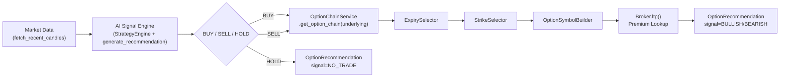

# Options Trading — Phase 2: AI-Driven Option Recommendation

## Scope

Phase 2 connects the existing AI Signal Engine (Strategy Engine +
Intraday AI Instructor, `app/strategy` + `app/instructor`, already
serving `GET /api/v1/signals`) to Phase 1's option-chain infrastructure
(`app/options`, see `docs/OPTIONS_PHASE1.md`) to **recommend** one
option contract for a configured underlying. It adds exactly one new
endpoint, `GET /api/v1/options/recommendation`.

**It is a recommendation only.** This endpoint never places an order —
grep `app/options/` and `app/api/v1/routers/options.py` for
`place_order`: there are no matches. Paper Trading (`app/paper`), Auto
Trading (`app/auto`), and risk management (`app/auto/risk.py`) are
untouched; none of them call into this endpoint or `app.options.recommendation`.

## Architecture



`app/options/recommendation.py`'s `generate_option_recommendation` is the
only file in `app/options` allowed to import from `app.instructor`,
`app.strategy`, and `app.market` — every other file in the package stays
strategy/broker-agnostic infrastructure, reusable independent of this
specific recommendation flow.

## Request flow, step by step

1. `fetch_recent_candles(broker, broker_name, Exchange.NSE, underlying, timeframe)`
   — the exact same call `app.api.v1.routers.signals` makes; no new
   market-data path.
2. The latest candle's `close` becomes `underlying_ltp` — reused instead
   of a second `broker.ltp()` call, so the reported LTP is exactly what
   the AI Signal Engine analyzed, and no redundant broker round trip
   happens.
3. `StrategyEngine().analyze_symbol(...)` -> `generate_recommendation(...)`
   — unchanged from the Signal API's pipeline, producing an
   `InstructorRecommendation` with `action` = `BUY`/`SELL`/`HOLD`.
4. `action` maps to this package's own vocabulary
   (`app.options.schemas.OptionSignal`, deliberately distinct from
   `app.strategy.models.SignalDirection` — see that class's docstring):
   `BUY -> CE/BULLISH`, `SELL -> PE/BEARISH`, `HOLD -> NO_TRADE`.
5. **HOLD returns immediately** with every contract field `None` — the
   option chain is never fetched, since there is nothing to select.
6. For BUY/SELL: `OptionChainService.get_option_chain(underlying)` ->
   `ExpirySelector.select(...)` -> `StrikeSelector.select(...)` ->
   `OptionSymbolBuilder().build(...)`.
7. The built symbol's premium is fetched via `broker.ltp(Exchange.NFO, tradingsymbol)`.
   A `BrokerAPIError`/`BrokerConnectionError` here is wrapped into
   `PremiumUnavailableError`, so callers only ever see this package's
   own exception types.
8. The result is returned as an `OptionRecommendation`.

### Known Phase 2 limitation: constructed, not chain-verified, symbol

Step 6 builds the trading symbol with `OptionSymbolBuilder` rather than
looking it up via `chain.instrument_for(expiry, strike, option_type)`.
This is a deliberate simplification, consistent with
`OptionSymbolBuilder`'s own docstring caveat (prefer the chain's real
rows — ground truth from the broker — whenever correctness against the
broker's exact listed contract matters). Because this endpoint only ever
recommends and never places an order, a builder/chain mismatch has no
execution consequence today; it is documented here as a known gap to
revisit before any future phase wires this into order placement.

## API example

### Request

```
GET /api/v1/options/recommendation?underlying=NIFTY&timeframe=5minute
```

### Response — BUY signal

```json
{
  "underlying": "NIFTY",
  "signal": "BULLISH",
  "tradingsymbol": "NIFTY07AUG202624000CE",
  "expiry": "2026-08-07",
  "strike": 24000.0,
  "option_type": "CE",
  "premium": 142.35,
  "underlying_ltp": 24012.6,
  "confidence": 72.4,
  "reasoning": "BUY: 2 of 3 strategies agree (BULLISH). EMA_TREND: EMA(9) above EMA(21): uptrend; ADX=27.3 confirms trend strength (>= 20); SuperTrend direction agrees (up). Selected ATM strike 24000 CE expiring 2026-08-07.",
  "generated_at": "2026-07-28T09:45:00Z"
}
```

### Response — HOLD (NO_TRADE)

```json
{
  "underlying": "NIFTY",
  "signal": "NO_TRADE",
  "tradingsymbol": null,
  "expiry": null,
  "strike": null,
  "option_type": null,
  "premium": null,
  "underlying_ltp": 24012.6,
  "confidence": 0.0,
  "reasoning": "HOLD: no strategy found a qualifying setup.",
  "generated_at": "2026-07-28T09:45:00Z"
}
```

## `TRADING_MODE` configuration

`Settings.trading_mode` (env var `TRADING_MODE`) gates this endpoint:
requests are rejected with `TradingModeNotEnabledError` (400) unless it
is `"OPTIONS"`. It has no other effect anywhere in this codebase — the
Signal API, Paper Trading, and Auto Trading behave identically regardless
of its value.

`TRADING_MODE` accepts case-insensitive input as of Phase 2
(`TRADING_MODE=options` and `TRADING_MODE=OPTIONS` are equivalent) via an
additive `field_validator` on `Settings.trading_mode` — the underlying
`Literal["EQUITY", "OPTIONS"]` and its `"EQUITY"` default are unchanged.

## Settings reference

| Field | Env var | Default | Effect on Phase 2 |
|---|---|---|---|
| `trading_mode` | `TRADING_MODE` | `"EQUITY"` | Must be `"OPTIONS"` (any case) for the endpoint to serve a recommendation. |
| `option_underlyings` | `OPTION_UNDERLYINGS` | `["NIFTY","BANKNIFTY","FINNIFTY"]` | The only valid values for `?underlying=`; enforced by `OptionChainService`. |
| `option_strike_mode` | `OPTION_STRIKE_MODE` | `"ATM"` | Default `StrikeMode` passed to `StrikeSelector`. |
| `option_expiry_mode` | `OPTION_EXPIRY_MODE` | `"NEAREST_WEEKLY"` | Default `ExpiryMode` passed to `ExpirySelector`. |
| `option_chain_refresh_seconds` | `OPTION_CHAIN_REFRESH_SECONDS` | `30.0` | How fresh a cached chain must be before `OptionChainService` re-fetches. |
| `default_broker` | `DEFAULT_BROKER` | `angel_one` | Which broker serves candles/premium; also which broker's identity is passed to `fetch_recent_candles` for error reporting. |

## Error mapping

All new/reused exceptions are handled by `app.core.exception_handlers`
(registered against `OptionsError`, covering every subclass):

| Exception | HTTP status | Meaning |
|---|---|---|
| `TradingModeNotEnabledError` | 400 | `TRADING_MODE` isn't `OPTIONS`. |
| `UnsupportedUnderlyingError` | 400 | `underlying` isn't configured. |
| `ExpiryNotFoundError` | 404 | No expiry satisfies the configured mode. |
| `StrikeNotFoundError` | 404 | No strike available to select from. |
| `PremiumUnavailableError` | 502 | Broker LTP lookup for the contract failed. |
| `OptionsInfrastructureUnavailableError` | 503 | No `OptionChainService` configured (non-Angel-One broker). |
| `InvalidOptionChainDataError` | 502 | Chain fetch succeeded but parsed to nothing usable. |
| `OptionChainFetchError` | 503 | Broker chain fetch failed (network/API). |
| `NoHistoricalDataError` | 404 | No candle data for `underlying`. |
| `InvalidHistoricalDataError` | 502 | A returned candle failed validation. |

## Future Integration (NOT part of Phase 2)

- **Order placement through options** — this endpoint only recommends;
  no code path in `app/options` or `app/api/v1/routers/options.py` calls
  `place_order` or any order-placement type.
- **Options risk management** — margin/Greeks-aware position sizing and
  exposure limits distinct from `app/auto/risk.py`'s equity-only logic;
  `app/auto/orchestrator.py` and `app/auto/risk.py` are untouched by
  Phase 2.
- **Dashboard option-chain/recommendation view** — no Angular UI change;
  the Angular app has no knowledge of this endpoint.
- **Auto-trading using this endpoint** — `AutoTradingOrchestrator` never
  calls `generate_option_recommendation` or
  `/api/v1/options/recommendation`; wiring that up is a future phase.
- **Chain-verified trading symbols** — see "Known Phase 2 limitation"
  above.
- **Multi-broker option sources** — unchanged from Phase 1: only
  `AngelOneOptionInstrumentSource` exists.
