# Options Trading — Phase 3: Paper Option Execution

## Scope

Phase 3 connects Phase 2's `OptionRecommendation` (`app/options/recommendation.py`,
see `docs/OPTIONS_PHASE2.md`) to the EXISTING Paper Trading Engine
(`app/paper`, already serving `/api/v1/paper/*`) so the AI can execute
**PAPER-ONLY** option trades: track premium, P&L, portfolio, and trade
history. It adds three new endpoints:

- `POST /api/v1/options/paper/orders`
- `POST /api/v1/options/paper/exit`
- `GET /api/v1/options/paper/trades`

**No real broker order placement anywhere.** Grep `app/options/` for
`place_order`/`modify_order`/`cancel_order`: the only matches are
`engine.place_order` (`app.paper.engine.PaperTradingEngine`, the
simulator) and docstring prose — never `BrokerInterface.place_order`/
`modify_order`/`cancel_order`. The only broker call this phase adds is
`broker.ltp()`, for live premium reads.

Auto Trading (`app/auto`), the Angular dashboard, and every existing
`/api/v1/paper/*` and `/api/v1/options/recommendation` route are
untouched — this phase is purely additive.

## Architecture

```mermaid
flowchart LR
    A["Market Data"] --> B["AI Analysis\n(StrategyEngine + Instructor)"]
    B --> C["Option Recommendation\n(app.options.recommendation, Phase 2)"]
    C --> D{"signal"}
    D -->|NO_TRADE| Z["No order placed\n(HOLD is a valid outcome)"]
    D -->|BULLISH/BEARISH| E["enter_option_position\n(app.options.paper_trading)"]
    E --> F["Paper Option Order\n(PaperOrderRequest, exchange=NFO,\nsame PaperTradingEngine.place_order\nas equity orders)"]
    F --> G["Option Position\n(same PaperPosition/PositionManager\nas equity, keyed by NFO symbol)"]
    G --> H["Live Premium Tracking\n(broker.ltp() feeds\nengine.update_price)"]
    H --> I["Option P&L\n(same (price - avg_price) * quantity\nmath PaperPosition already has)"]
    I --> J["Portfolio\n(same PortfolioManager.snapshot(),\noptions + equity coexist)"]
    J --> K["Trade History\n(get_option_trade_history:\nread-side enrichment over\nengine.get_trades())"]
```



Every reused component above is the exact same class equity orders
already go through — `app.options.paper_trading` never subclasses or
wraps `PaperTradingEngine`, `PortfolioManager`, `PositionManager`, or
`OrderManager`. `git diff --stat app/paper/` after this phase is empty:
not one line of the Paper Trading Engine changed.

## Why no new Portfolio/PnL engine

`app.paper.engine.PaperTradingEngine` (and the `PortfolioManager`/
`PositionManager`/`OrderManager` it wires together) is already fully
generic:

- Every position is keyed by `(Exchange, symbol)` —
  `app.paper.position_manager.PositionManager` has no notion of
  "equity" vs. "option"; `Exchange.NFO` already exists in
  `app.domain.enums.trading.Exchange`.
- P&L math is plain `quantity`-based arithmetic:
  `PaperPosition.unrealized_pnl == (last_price - average_price) * quantity`
  (enforced by that model's own validator), and
  `ClosedTrade.pnl == (exit_price - entry_price) * quantity` for a BUY
  (the mirror-image formula for a SELL) — nothing here assumes one
  share equals one unit of exposure.
- Cash/reservation/fill-matching (`OrderManager`), FIFO lot bookkeeping
  (`PositionManager`), and cash/equity/realized-P&L composition
  (`PortfolioManager.snapshot`) all operate purely in terms of
  `quantity * price`, with no equity-specific assumption anywhere.

An option position is, to this engine, just another symbol on `NFO`
with a bigger `quantity` (`lots * lot_size`, computed by
`app.options.lot_sizing.resolve_lot_size`) and `price` playing the role
premium plays. `app.options.paper_trading.enter_option_position` /
`exit_option_position` therefore build a `PaperOrderRequest` exactly the
way `POST /api/v1/paper/order` already does, and call
`PaperTradingEngine.place_order`/`get_position`/`get_positions`
/`get_portfolio`/`get_trades` unchanged.

If a second engine had been built instead, it would have had to
duplicate: cash reservation and debit/credit accounting
(`PortfolioManager`), FIFO lot closing and realized-P&L attribution
(`PositionManager`), bracket/OCO order matching (`OrderManager`), and
the `Portfolio`/`PaperPosition`/`ClosedTrade` invariant-checked models
themselves — all of it re-verified from scratch, all of it a second
source of truth to keep in sync with the first. None of that exists in
`app/options/paper_trading.py`; it is a thin bridge (recommendation ->
`PaperOrderRequest`, plus a small risk gate and read-side trade-history
enrichment) precisely so none of that duplication was necessary.

## Data flow

### Entry (`POST /api/v1/options/paper/orders`)

1. `generate_option_recommendation(...)` — the exact Phase 2 call,
   producing an `OptionRecommendation`.
2. If `signal is NO_TRADE`: return `{recommendation, order: null}` — a
   HOLD signal is a legitimate, successful outcome, not an error.
3. Otherwise, `enter_option_position(...)`:
   - `lots` validated against `0 < lots <= max_lots_per_order`
     (`InvalidLotQuantityError` otherwise).
   - `OptionChainService.get_option_chain(underlying)` ->
     `resolve_lot_size(chain, expiry, strike, option_type, default_lot_size)`
     — the chain's own broker-sourced `OptionInstrument.lot_size` wins
     when present; `Settings.option_default_lot_size` is the documented
     fallback.
   - `quantity = lots * lot_size`.
   - A **fresh** premium is fetched via `broker.ltp(Exchange.NFO, tradingsymbol)`
     — `recommendation.premium` is never reused, since it may be stale
     by the time an order is actually placed.
   - Current NFO premium exposure is summed from
     `engine.get_positions()` (`abs(quantity) * average_price` per open
     NFO position) — not tracked separately, always read live off the
     engine.
   - `OptionRiskManager.check_order_allowed(...)` — see Risk Model
     below; a failing check raises `OptionRiskLimitExceededError`
     carrying the specific `reason`.
   - A `PaperOrderRequest` is built (`exchange=NFO`, `side=BUY`,
     `order_type=MARKET`, `tag="OPTION_ENTRY"`, and
     `stop_loss_price`/`target_price` passed straight through from the
     request body) and placed via `engine.place_order(...)` — a
     `TradeMetadata(confidence=..., reasoning=...)` carries the AI's
     provenance onto the order/eventual `ClosedTrade`, exactly like any
     other paper order.
   - A `REJECTED` order (e.g. insufficient paper cash) is returned, not
     raised — the same philosophy `POST /api/v1/paper/order` already
     documents: a validly-recorded rejection is a successful placement
     outcome.
4. Setting `stop_loss_premium`/`target_premium` on the request attaches
   a bracket exit pair to the entry via the **existing**
   `app.paper.order_manager.OrderManager._maybe_spawn_bracket_children`
   — no new exit-triggering mechanism was built for `TARGET`/`STOP_LOSS`
   exits.

### Exit (`POST /api/v1/options/paper/exit`)

1. `engine.get_position(tradingsymbol, Exchange.NFO)` — `None` or flat
   raises `OptionPositionNotFoundError`.
2. `exit_quantity` defaults to the full open quantity, or the
   caller-supplied `quantity` (must be `0 < quantity <= abs(position.quantity)`,
   else `ValueError` — a caller-contract violation).
3. A fresh premium is fetched via `broker.ltp(...)`.
4. `portfolio.realized_pnl` is snapshotted before and after the closing
   `engine.place_order(...)` call; the delta is fed to
   `risk_manager.record_trade_closed(pnl_delta, ...)` — realized P&L is
   never recomputed here, only diffed off the engine's own number.
5. `reason` (`MANUAL`/`TARGET`/`STOP_LOSS`) becomes the closing order's
   `tag` — this is how `get_option_trade_history` later reports why a
   trade closed.

`TARGET`/`STOP_LOSS` exits never call `exit_option_position` — they are
produced automatically by the bracket mechanism once price crosses the
configured level; this endpoint exists only for an explicit `MANUAL`
close (or a caller-driven partial exit).

## Portfolio Model

Options and equity positions **coexist in one `Portfolio`** —
`GET /api/v1/paper/portfolio` already reflects both, since they're
stored in the same `PaperTradingEngine`/`PositionManager`, distinguished
only by `Exchange` (`NSE` vs. `NFO`) on each `PaperPosition`. **No
separate `/api/v1/options/paper/portfolio` or `/paper/positions` route
exists** — this is a deliberate design decision (see
`app.api.v1.routers.options.get_option_paper_trades`'s docstring), not
an oversight: adding one would just repeat data `GET /api/v1/paper/portfolio`
and `GET /api/v1/paper/positions` already serve correctly, under a
second URL.

## PnL Formula

Identical to equity, because it's the same engine:

```
unrealized_pnl = (current_premium - premium_paid) * quantity
realized_pnl   = (exit_premium    - entry_premium) * quantity      # BUY (long)
```

(`PaperPosition`/`ClosedTrade`'s own docstrings state this in terms of
`price`; for an option position `price` *is* the premium — see "Why no
new Portfolio/PnL engine" above.) `quantity` is `lots * lot_size`, so a
one-lot NIFTY CE position with `lot_size=50` moving Rs. 5 in premium
realizes/unrealizes Rs. 250, exactly as the formula above computes with
no options-specific special case.

## Risk Model

`app.options.risk.OptionRiskManager` is a **new, fully independent**
risk gate — it does not extend `app.auto.risk.AutoRiskManager`, and it
is not built on top of a generic `RiskEngine`, because **no such wired-in
engine exists in this codebase today**: `app/risk/models.py` and
`app/risk/dto.py` exist, but there is no `app/risk/engine.py` — nothing
in `app.risk` is constructed or consulted anywhere in the running
application. `AutoRiskManager` itself is explicitly out of scope for
this phase (Auto Trading integration is Phase 5). `OptionRiskManager`
therefore mirrors `AutoRiskManager`'s *shape* (a day-scoped,
IST-midnight-rollover counter) with its own ~10-line rollover helper,
rather than importing across either boundary.

Four checks, evaluated in this order (`OptionRiskCheckResult.reason`
always names the first one hit):

| # | Check | Setting |
|---|-------|---------|
| 1 | Active daily-loss lockout (today's realized option P&L `<= -max_daily_loss`) | `OPTION_MAX_DAILY_LOSS` (default 10,000) |
| 2 | `lots > max_lots_per_order` | `OPTION_MAX_LOTS_PER_ORDER` (default 10) |
| 3 | `order_premium_value > max_premium_per_order` | `OPTION_MAX_PREMIUM_PER_ORDER` (default 50,000) |
| 4 | `current_premium_exposure + order_premium_value > max_premium_exposure` | `OPTION_MAX_PREMIUM_EXPOSURE` (default 200,000) |

`OptionRiskManager` is constructed once in `app.main`'s lifespan
(`app.state.option_risk_manager`), under the identical condition as
`app.state.option_chain_service` — only when the resolved broker is
Angel One, `None` otherwise (there is no usable premium/chain source to
guard without one).

## API Examples

### `POST /api/v1/options/paper/orders`

Request:

```json
{
  "underlying": "NIFTY",
  "timeframe": "5minute",
  "lots": 2,
  "stop_loss_premium": 80.0,
  "target_premium": 150.0
}
```

Response (`201`, actionable signal):

```json
{
  "recommendation": {
    "underlying": "NIFTY",
    "signal": "BULLISH",
    "tradingsymbol": "NIFTY07AUG202624000CE",
    "expiry": "2026-08-07",
    "strike": 24000.0,
    "option_type": "CE",
    "premium": 118.5,
    "underlying_ltp": 24012.4,
    "confidence": 78.0,
    "reasoning": "BUY: 2 of 3 strategies agree. Selected ATM strike 24000 CE expiring 2026-08-07.",
    "generated_at": "2026-07-28T10:00:00Z"
  },
  "order": {
    "order_id": "b1e0...",
    "symbol": "NIFTY07AUG202624000CE",
    "exchange": "NFO",
    "side": "BUY",
    "order_type": "MARKET",
    "quantity": 100,
    "status": "COMPLETE",
    "average_fill_price": 120.1,
    "stop_loss_price": 80.0,
    "target_price": 150.0,
    "tag": "OPTION_ENTRY"
  }
}
```

Response (`201`, `NO_TRADE`):

```json
{
  "recommendation": { "underlying": "NIFTY", "signal": "NO_TRADE", "...": "..." },
  "order": null
}
```

### `POST /api/v1/options/paper/exit`

Request:

```json
{ "tradingsymbol": "NIFTY07AUG202624000CE", "reason": "MANUAL", "quantity": 50 }
```

Response (`200`, a `PaperOrder`):

```json
{
  "order_id": "c2f1...",
  "symbol": "NIFTY07AUG202624000CE",
  "exchange": "NFO",
  "side": "SELL",
  "quantity": 50,
  "status": "COMPLETE",
  "average_fill_price": 135.0,
  "tag": "MANUAL"
}
```

### `GET /api/v1/options/paper/trades`

```json
[
  {
    "trade_id": "d3a2...",
    "underlying": "NIFTY",
    "tradingsymbol": "NIFTY07AUG202624000CE",
    "entry_premium": 120.1,
    "exit_premium": 135.0,
    "pnl": 745.0,
    "holding_seconds": 3600.0,
    "reason": "MANUAL",
    "confidence": 78.0,
    "reasoning": "BUY: 2 of 3 strategies agree. ...",
    "entry_timestamp": "2026-07-28T10:00:05Z",
    "exit_timestamp": "2026-07-28T11:00:05Z"
  }
]
```

All three routes are gated behind `TRADING_MODE=OPTIONS`
(`TradingModeNotEnabledError`, 400) for consistency with the existing
`GET /api/v1/options/recommendation` route, and require
`app.state.option_chain_service`/`option_risk_manager` to be configured
(`OptionsInfrastructureUnavailableError`, 503 — the resolved broker
isn't Angel One).

## Future Integration

Explicitly not built in this phase:

- **Auto Trading wiring (Phase 5)** — `app.auto.orchestrator
  .AutoTradingOrchestrator` does not yet call into
  `app.options.paper_trading`; automatic, unattended option entries/exits
  driven by `AutoTradingConfig` remain future work.
- **Dashboard views (Phase 4)** — no Angular UI surfaces these three
  routes yet.
- **Trailing-stop exits** — `app.paper.dto.PaperOrderType.TRAILING_STOP`
  exists in the engine but `enter_option_position` only ever attaches a
  fixed `stop_loss_price`/`target_price` bracket, never a trailing one.
- **Live/real order execution** — no code path in this phase (or any
  prior phase) calls `BrokerInterface.place_order`/`modify_order`
  /`cancel_order` for options; every order stays inside
  `PaperTradingEngine`.
- **Multi-broker premium sourcing** — `option_chain_service`/
  `option_risk_manager` are only ever constructed for a resolved Angel
  One broker (Phase 1's only `OptionInstrumentSource` implementation);
  Zerodha/Upstox option chains remain unimplemented.
