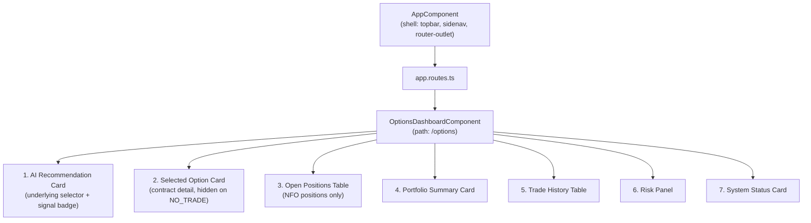

# Options Trading — Phase 4: Options Dashboard (Frontend)

## Scope

Phase 4 is **frontend + tiny additive API integration only** — no
business logic changes, no new trading logic, no order-execution
changes. It builds one new Angular page,
`OptionsDashboardComponent` (route `/options`), that displays the
output of Phases 1-3 (`GET /api/v1/options/recommendation`,
`GET /api/v1/options/paper/trades`, `GET /api/v1/paper/portfolio`,
`GET /api/v1/paper/positions`, `GET /api/v1/auto/status`) plus two
small backend additions made purely to satisfy this page's read needs:

- Five additive fields on the existing `GET /health` response.
- One new read-only endpoint, `GET /api/v1/options/risk/status`.

This dashboard **never places or exits a trade** — every section is
display-only. `ApiService` deliberately has no
`placeOptionOrder`/`exitOptionOrder` methods; order execution stays
where Phase 3 left it (`POST /api/v1/options/paper/orders`,
`POST /api/v1/options/paper/exit`), reachable only via direct API calls
or a future phase, not from this dashboard.

`git diff --stat` after this phase touches only:

- `app/api/v1/routers/health.py` (additive fields)
- `app/api/v1/routers/options.py` (one additive route)
- `app/options/schemas.py` (one additive Pydantic model, `OptionRiskStatus`)
- `app/options/paper_trading.py` (pure refactor: extracts the existing
  exposure-sum expression into `get_option_premium_exposure`, called
  from both the existing `enter_option_position` and the new route —
  same arithmetic, same result, just named and shared)
- `frontend/src/app/**` (new page + additive `models.ts`/`api.service.ts`)
- test files mirroring each of the above

Nothing under `app/paper/`, `app/auto/`, `app/options/recommendation.py`,
or `app/options/risk.py` changed.

## Component Hierarchy



`OptionsDashboardComponent` sits alongside every other page
(`OverviewComponent`, `PortfolioComponent`, `PositionsComponent`, ...)
as a lazy-loaded route child of `AppComponent`'s `<router-outlet>` — it
is not nested inside, or a variant of, any existing page component. Its
one nav link (`{ path: '/options', label: 'Options Dashboard' }`) was
appended to `AppComponent.navLinks`, which is why
`app.component.spec.ts`'s `.sidenav a` count assertion moved from `8`
to `9` — the one deliberate, expected test-count change this phase
requires.

## API Usage

| Section | Endpoint(s) | Polling cadence |
|---|---|---|
| 1. AI Recommendation | `GET /api/v1/options/recommendation?underlying=...&timeframe=5minute` | every 2s, **plus** immediately on every underlying-selector change |
| 2. Selected Option | (same response as #1 — no separate call) | — |
| 3. Open Positions | `GET /api/v1/paper/positions`, filtered client-side to `exchange === 'NFO'` | every 2s |
| 4. Portfolio Summary | `GET /api/v1/paper/portfolio` | every 2s |
| 5. Trade History | `GET /api/v1/options/paper/trades` | every 2s |
| 6. Risk Panel | `GET /api/v1/options/risk/status` (new, Phase 4) | every 2s |
| 7. System Status | `GET /health` (extended, Phase 4), `GET /api/v1/auto/status`, plus the live/error state of the Portfolio Summary poll | every 2s |

## Refresh Strategy

Every section polls independently on the shared `pollEvery` helper
(`frontend/src/app/core/polling.ts`), which fires immediately and then
every `POLL_INTERVAL_MS` (2000ms) — the same cadence every other page
in this app already uses, so Options Dashboard behaves identically to
Portfolio/Positions/Auto Trading/etc. Each poll subscription has its
own `error`/`catchError` handling so one failing source (most likely
the recommendation or risk-status calls, since both 503 whenever
`app.state.option_chain_service`/`option_risk_manager` is `None` — the
resolved broker isn't Angel One) never stops the other six sections
from refreshing.

The Recommendation card has one refresh path beyond the shared 2s
cadence: selecting a different underlying re-fires the recommendation
call immediately, without waiting for the next tick. This is built with
`toObservable(selectedUnderlying)` (from
`@angular/core/rxjs-interop`, available in Angular 19) piped through
`switchMap` into `pollEvery(() => api.getOptionRecommendation(underlying))`
— `switchMap` guarantees an in-flight call for a just-abandoned
underlying is cancelled rather than racing the new selection's result
onto the screen.

No websocket infrastructure was introduced — polling at 2s intervals
was judged sufficient for every other page in this app, and the phase
brief explicitly declines new push infrastructure for this feature too.

## Backend Additions and Why

### 1. `GET /health` — five additive fields

```json
{
  "status": "ok", "app_name": "...", "app_env": "...",
  "uptime_seconds": 12.3, "ready": true,
  "trading_mode": "OPTIONS",
  "default_broker": "angel_one",
  "options_infrastructure_available": true,
  "option_underlyings": ["NIFTY", "BANKNIFTY", "FINNIFTY"],
  "option_default_lot_size": 50
}
```

Needed because:

- `trading_mode`/`default_broker`/`options_infrastructure_available` —
  the System Status card (section 7) has to tell the user *why* the
  Recommendation/Risk Panel cards might be showing an unavailable
  state, without duplicating that logic in three places.
- `option_underlyings` — seeds the underlying selector (section 1) with
  the real configured list rather than a hardcoded guess, the moment
  the first `/health` poll resolves. A hardcoded
  `['NIFTY', 'BANKNIFTY', 'FINNIFTY']` default is shown before that
  first poll lands, so the selector is never empty.
- `option_default_lot_size` — the only number available client-side to
  approximate a position's lot count (see Approximations below);
  `PaperPosition` itself carries no lot-size field.

All five are read off already-injected `settings`/`request.app.state`
with the same defensive `getattr(..., False)` style the existing
`ready` field already uses — no new dependency, no I/O, so `/health`
stays exactly as cheap and synchronous as before.

### 2. `GET /api/v1/options/risk/status` — new endpoint

```json
{
  "current_premium_exposure": 5000.0,
  "max_premium_exposure": 200000.0,
  "remaining_premium_capacity": 195000.0,
  "daily_realized_pnl": 500.0,
  "max_daily_loss": 10000.0,
  "max_lots_per_order": 10,
  "max_premium_per_order": 50000.0
}
```

Needed because the Risk Panel (section 6) needs a live view of the
Phase 3 `OptionRiskManager`'s counters and the configured limits they're
measured against, and nothing in Phases 1-3 exposed that. Gated behind
`TRADING_MODE=OPTIONS` (`TradingModeNotEnabledError`, 400) and requires
`app.state.option_risk_manager` to be configured
(`OptionsInfrastructureUnavailableError`, 503) — identical gating to
every other route in `app/api/v1/routers/options.py`.

`current_premium_exposure` is computed by a new, small,
**pure-refactor** helper in `app/options/paper_trading.py`:

```python
async def get_option_premium_exposure(engine: PaperTradingEngine) -> float:
    positions = await engine.get_positions()
    return sum(abs(p.quantity) * p.average_price for p in positions if p.exchange is Exchange.NFO)
```

`enter_option_position`'s own risk check was inlining this exact
expression before Phase 4; it now calls the extracted function instead
— same arithmetic, same result, verified by
`tests/unit/options/test_paper_trading.py`'s existing
`enter_option_position` test suite (unchanged pass/fail behavior) plus
one new test for the extracted function directly. This guarantees the
read-only status endpoint can never compute a different exposure figure
than a real order attempt would see.

## Frontend Files

- `frontend/src/app/core/models.ts` — additive `OptionSignal`,
  `OptionType`, `OptionRecommendation`, `OptionTradeHistoryEntry`,
  `OptionRiskStatus`, `HealthResponse` interfaces, field-for-field
  matched to `app/options/schemas.py` and the `/health` additions above.
- `frontend/src/app/core/api.service.ts` — additive `getHealth()`,
  `getOptionRecommendation()`, `getOptionTrades()`,
  `getOptionRiskStatus()`. `getHealth()` calls
  `http://localhost:8000/health` directly (no `/api/v1` prefix) since
  `app.api.v1.routers.health`'s `APIRouter` is mounted with no prefix in
  `app.main.create_app` — every other method on this service calls
  `API_BASE` (`.../api/v1`), so this one deliberately does not.
- `frontend/src/app/pages/options-dashboard/options-dashboard.component.{ts,html,scss}`
  — the new page, standalone, importing `CommonModule` and (component-
  local only) `FormsModule` for the underlying `<select>`'s
  `[(ngModel)]` binding — no other page in this app used `FormsModule`
  or a `<select>` before this, so it was added scoped to this
  component's own `imports` array, not app-wide.
- `frontend/src/app/pages/options-dashboard/options-dashboard.component.spec.ts`
  — the first page-level component spec in this app (previously only
  `app.component.spec.ts` existed); mirrors its `TestBed` +
  `provideHttpClientTesting()` setup, using `HttpTestingController` to
  flush mock responses for every polled endpoint.
- `frontend/src/app/app.routes.ts` — one additive lazy route (`/options`).
- `frontend/src/app/app.component.ts` — one additive `navLinks` entry.
- `frontend/src/app/app.component.spec.ts` — `.sidenav a` count updated
  `8` -> `9` (see Component Hierarchy above).

## Documented Approximations and Limitations

- **"Lots" column (Open Positions table)** — computed client-side as
  `Math.round(Math.abs(quantity) / (health()?.option_default_lot_size ?? 1))`.
  `PaperPosition` (`app/paper/models.py`) has no `lot_size` field of its
  own, so this divides by the *default* configured lot size, not the
  actual per-contract lot size a given position was opened with (which
  can differ — see `resolve_lot_size` in Phase 3). The table cell
  carries a `title` tooltip stating this is approximate. Never fed back
  into any order-sizing logic — display only.
- **"Total P&L (since reset)" label (Portfolio Summary)** — `Portfolio.total_pnl`
  is cumulative since the last paper-trading reset, not day-scoped.
  Rather than mislabel it "Today's P&L", it's labelled honestly. A
  genuinely day-scoped number does exist — `OptionRiskStatus.daily_realized_pnl`
  — but it's options-only, not whole-portfolio, so it's shown separately
  in the Risk Panel ("Daily Loss") rather than conflated with the
  portfolio-wide total.
- **"Backend Ready" (System Status)**, not "Broker Connected" — `/health`'s
  `ready` flag reflects application-startup completion
  (`app.state.ready`, set once by `app.main`'s lifespan), not a live
  broker-authentication check; see that router's own module docstring.
  Labelling it "Broker Connected" would overstate what is actually
  verified.
- **Hardcoded "OPEN" position status (Open Positions table)** — every
  row in `GET /api/v1/paper/positions` is, by construction, an open
  position; a fully-closed position is removed from the engine's
  position map entirely, not retained with a status flag. The table
  therefore hardcodes the literal `"OPEN"` per row rather than reading a
  status field that doesn't exist on `PaperPosition`.
- **"Paper Trading Status" (System Status)** — derived from whether the
  Portfolio Summary poll is currently succeeding
  (`portfolioError() === null && portfolio() !== null`), not a new
  backend field — the existing portfolio poll already carries this
  information.
- **Return % / Market Value** — `Return %` is derived client-side as
  `(total_pnl / initial_capital) * 100`; the Portfolio Summary card
  labels `equity` as "Equity / Market Value" rather than deriving a new
  `equity - cash` figure the backend doesn't literally return, since
  `equity` already *is* the portfolio's total market value in this
  engine's model.

## Future Enhancements (explicitly out of scope for Phase 4)

- A real per-position lot size returned by `GET /api/v1/paper/positions`
  (or a Phase 3 enrichment endpoint), removing the "Lots" approximation
  above entirely.
- A genuinely day-scoped, whole-portfolio (not options-only) P&L field,
  removing the "since reset" caveat on the Portfolio Summary card.
- Live order placement/exit **from this dashboard** — Phase 4 is
  display-only by design; `POST /api/v1/options/paper/orders` and
  `POST /api/v1/options/paper/exit` remain reachable only via direct API
  calls, not through any control on this page.
- Websocket-based push updates in place of 2-second polling — explicitly
  declined for this phase; every other page in this app already polls
  on the same cadence, and the phase brief calls out not introducing
  unnecessary websocket infrastructure.
- Auto Trading integration for options (still Phase 5+, per
  `docs/OPTIONS_PHASE3.md`'s Future Integration section) — the "Auto
  Trading Status" badge on this dashboard reflects the existing,
  equity-only `AutoTradingStatus`; there is no options-specific
  auto-trading status yet to show instead.

## Screenshot Placeholders

```
+--------------------------------------------------------------------+
| Options Dashboard                                                   |
+--------------------------------------------------------------------+
| [ AI Recommendation ]                    Underlying: [ NIFTY  v]    |
|  NIFTY   [BULLISH]                                                  |
|  Confidence: 78.0%                                                  |
|  "BUY: 2 of 3 strategies agree. Selected ATM strike 24000 CE..."    |
+--------------------------------------------------------------------+
| [ Selected Option ]                                                 |
|  Trading Symbol: NIFTY07AUG202624000CE   Strike: 24000   CE         |
|  Current Premium: Rs.118.50   Underlying LTP: Rs.24012.40           |
+--------------------------------------------------------------------+
| [ Open Positions (1) ]                                              |
|  Symbol                    Qty  Lots  Entry   Cur.   uPnL  Status   |
|  NIFTY07AUG202624000CE     50   1     100.0   105.0  250.0  OPEN    |
+--------------------------------------------------------------------+
| [ Portfolio Summary ]   [ Trade History ]   [ Risk Panel ]           |
| [ System Status: Backend Ready | OPTIONS | Paper: ACTIVE | ... ]     |
+--------------------------------------------------------------------+
```

(Plain-text placeholder per this phase's own instructions — no image
generation was attempted.)
