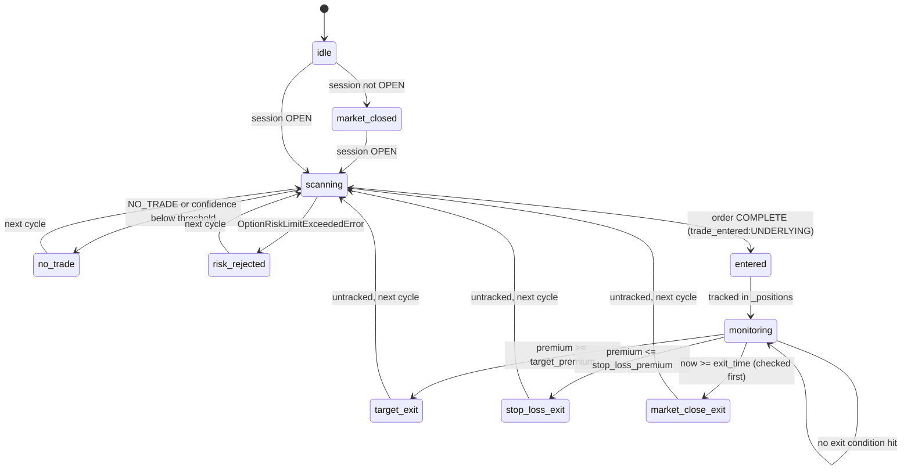

# Options Trading — Phase 5: Automated Options Paper Trading

## Scope

Phase 5 adds a scheduler that scans every configured underlying, and
automatically enters/monitors/exits **PAPER-ONLY** option positions —
no human in the loop, and no real broker order ever placed. It adds one
new module (`app/options/auto_trading.py`, `AutoOptionsOrchestrator`)
and three new routes under the existing options router:

- `GET /api/v1/options/auto/status`
- `POST /api/v1/options/auto/start`
- `POST /api/v1/options/auto/stop`

**No real broker order placement anywhere.** Grep `app/options/auto_trading.py`
for `place_order`/`modify_order`/`cancel_order`: the only matches are in
this file's own module docstring, stating that it never calls them —
every actual order goes through `app.options.paper_trading
.enter_option_position`/`exit_option_position`, which themselves only
ever call `PaperTradingEngine.place_order` (the simulator). The only
broker calls this phase adds are `broker.ltp()` reads, for fresh premium
checks.

`app/auto/` (equity Auto Trading), `app/options/recommendation.py`,
`app/options/risk.py`, and `app/options/paper_trading.py` are untouched —
this phase only calls into the last three, never modifies them.

## Why a separate orchestrator, not a mode inside the equity one

`app.auto.orchestrator.AutoTradingOrchestrator` is deeply equity-specific:
its `_AutoPosition`/`_exit_reason` machinery is built around
`InstructorRecommendation`'s `entry`/`stop_loss`/`targets` fields, and it
manages a trailing stop and signal-reversal exit that have no
options-domain equivalent. `app.options.risk.OptionRiskManager`'s own
docstring already established the precedent this phase follows: mirror
an existing equity-side class's *shape* (there: the day-rollover pattern;
here: the loop/task/status shape) as a fully independent class, rather
than subclassing or branching inside it. `AutoOptionsOrchestrator`
therefore has no import from `app.auto` at all.

## Architecture

```mermaid
flowchart LR
    A["Scheduler\n(AutoOptionsOrchestrator._run_loop,\nevery AUTO_OPTION_SCAN_INTERVAL_SECONDS,\ngated on current_session_state() is OPEN)"] --> B["AI Recommendation\n(generate_option_recommendation,\nStrategyEngine + Instructor pipeline)"]
    B --> C["Option Recommendation\n(OptionRecommendation:\nBULLISH/BEARISH/NO_TRADE)"]
    C --> D{"signal / confidence"}
    D -->|"NO_TRADE or\nconfidence < threshold"| Z["Skipped\n(logged, no order)"]
    D -->|"actionable"| E["Option Risk Check\n(enter_option_position calls\nOptionRiskManager.check_order_allowed\ninternally)"]
    E -->|"rejected"| ZZ["auto_option_risk_rejection\n(logged, no order)"]
    E -->|"allowed"| F["Paper Entry\n(enter_option_position ->\nPaperTradingEngine.place_order)"]
    F --> G["_AutoOptionPosition tracked\n(stop_loss/target = entry_premium\n* percent, this orchestrator's own math)"]
    G --> H["Position Monitoring\n(_monitor_exits, every cycle:\nbroker.ltp() vs tracked levels)"]
    H --> I{"Target / Stop Loss / Time Exit"}
    I -->|"hit"| J["Paper Exit\n(exit_option_position ->\nPaperTradingEngine.place_order)"]
    I -->|"not hit"| H
    J --> K["Trade History\n(get_option_trade_history,\nunchanged Phase 3 read path)"]
```



Every reused component is called exactly as an operator calling the
existing REST endpoints would: `generate_option_recommendation` (Phase 2),
`enter_option_position`/`exit_option_position` (Phase 3, which
internally invoke `OptionRiskManager.check_order_allowed` — never called
a second time by this orchestrator), and `PaperTradingEngine`/
`OptionChainService` underneath both.

## Stop-loss/target: a deliberate premium-percentage simplification

`OptionRecommendation` carries no price targets of its own — only
`confidence`/`reasoning` (unlike `InstructorRecommendation`, which has
`entry`/`stop_loss`/`targets`). `AutoOptionsOrchestrator` computes both
itself, once, from the actual fill premium:

```
stop_loss_premium = entry_premium * (1 - AUTO_OPTION_STOP_LOSS_PERCENT / 100)
target_premium    = entry_premium * (1 + AUTO_OPTION_TARGET_PERCENT    / 100)
```

There is **no Greeks/IV modeling anywhere in this phase** — no delta,
theta decay, or implied-volatility awareness feeds into either level.
This is a known, documented simplification, not an oversight: modeling
options P&L behavior properly would require a pricing model this
codebase does not have; a fixed percentage of premium is a simple,
auditable stand-in.

## Why exits are managed explicitly, not via bracket orders

`enter_option_position` accepts `stop_loss_premium`/`target_premium`
parameters that (per Phase 3) attach a bracket exit pair via
`OrderManager._maybe_spawn_bracket_children`. `AutoOptionsOrchestrator`
**always passes both as `None`** and instead re-checks every tracked
position's current premium against its levels every cycle, calling
`exit_option_position(..., reason=...)` explicitly when a level is
crossed. Two reasons, mirroring `app.auto.orchestrator`'s own documented
rationale for managing equity exits the same way:

1. **One place for every exit condition.** Target, stop-loss, and
   market-close square-off are all evaluated together, in the same
   priority order, every cycle — not split across a bracket mechanism
   (target/stop) and a second ad hoc code path (square-off).
2. **A bracket order needs a live price feed into the engine, which
   doesn't exist here.** A bracket order only ever fills when something
   calls `PaperTradingEngine.update_price` with a fresh NFO quote — and
   only `app.paper.broker.PaperBroker.ltp()` self-feeds the engine that
   way. A real, non-`PaperBroker` `BrokerInterface` (e.g. `AngelOneAdapter`)
   never does. Explicit per-cycle monitoring — calling `broker.ltp()`
   directly and comparing against the tracked levels — sidesteps this
   gap entirely, regardless of which broker is configured.

## Position tracking: one position per underlying

`AutoOptionsOrchestrator._positions: dict[str, _AutoOptionPosition]` is
keyed by the **underlying** string, not the tradingsymbol. Before
entering, `_maybe_enter` checks `underlying in self._positions` and skips
if already tracked — this also naturally prevents ever holding two
different strikes/expiries for the same underlying at once. A
`AUTO_MAX_OPEN_OPTION_POSITIONS` orchestrator-level count gate (checked
directly, as a guard clause) is separate from and in addition to
`OptionRiskManager`'s own per-order/exposure checks — `OptionRiskManager
.check_order_allowed` was deliberately never given an
`open_position_count` parameter (Phase 3), and this phase does not add
one, mirroring how `app.auto.orchestrator.AutoTradingOrchestrator` checks
its own position count directly rather than pushing it into
`AutoRiskManager`.

## `last_action` / position lifecycle state machine



`status().last_action` reports the machine-readable label for whichever
branch last ran: `"idle"`, `"market_closed"`, `"scanning"`,
`"trade_entered:{underlying}"`, or `"trade_exited:{underlying}:{reason}"`
(`reason` is `target`/`stop_loss`/`manual`, lowercased from
`OptionExitReason`).

`OptionExitReason` (`app.options.schemas`, Phase 3) has only
`MANUAL`/`TARGET`/`STOP_LOSS` — there is no dedicated `MARKET_CLOSE`
member, and this phase must not modify `app/options/schemas.py`. A
square-off exit is therefore reported to `exit_option_position` as
`MANUAL` (an actively-driven, non-bracket close — exactly what
`MANUAL`'s own docstring describes), and is distinguished from an
operator-initiated manual exit only by this orchestrator's own
`auto_option_market_close_exit` log event and the `market_close` suffix
in `last_action`. `GET /api/v1/options/paper/trades`' `reason` field for
such a trade will read `"MANUAL"`, same as any other actively-closed
trade — a known cosmetic limitation of reusing the existing vocabulary
rather than extending it.

## Configuration

| Setting | Default | Purpose |
|---|---|---|
| `AUTO_OPTIONS_ENABLED` | `false` | Whether `AutoOptionsOrchestrator` starts automatically at process startup (only takes effect when `TRADING_MODE=OPTIONS`). `POST /api/v1/options/auto/start` can start it at runtime either way. |
| `AUTO_OPTION_EXIT_TIME` | `15:20` | IST wall-clock time at/after which every tracked position is force-exited regardless of premium. |
| `AUTO_MAX_OPEN_OPTION_POSITIONS` | `3` | Orchestrator-level cap on simultaneously open (tracked) option positions. |
| `AUTO_OPTION_SCAN_INTERVAL_SECONDS` | `30` | How often the loop scans every underlying and re-checks every open position's exit conditions. |
| `AUTO_OPTION_CONFIDENCE_THRESHOLD` | `60.0` | Minimum `OptionRecommendation.confidence` acted on for a new entry. |
| `AUTO_OPTION_LOTS_PER_TRADE` | `1` | Fixed lot count requested for every auto-entered position — no dynamic position-sizing-by-capital logic in this phase. |
| `AUTO_OPTION_STOP_LOSS_PERCENT` | `30.0` | Percentage of entry premium below which a tracked position is stopped out. |
| `AUTO_OPTION_TARGET_PERCENT` | `50.0` | Percentage of entry premium above which a tracked position hits its target. |

`AutoOptionsOrchestrator` is constructed in `app.main`'s `lifespan` under
the exact same condition as `option_chain_service`/`option_risk_manager`
(only when the resolved broker is Angel One) — `app.state
.auto_options_orchestrator` is `None` otherwise, and every new route
raises `OptionsInfrastructureUnavailableError` (503) when it is.

## API Examples

### `GET /api/v1/options/auto/status`

```json
{
  "running": true,
  "started_at": "2026-07-28T03:45:00Z",
  "underlyings": ["NIFTY", "BANKNIFTY", "FINNIFTY"],
  "cycle_count": 42,
  "last_cycle_at": "2026-07-28T10:00:30Z",
  "last_scan_at": "2026-07-28T10:00:30Z",
  "next_scan_at": "2026-07-28T10:01:00Z",
  "last_action": "trade_entered:NIFTY",
  "open_position_count": 1,
  "trades_today": 3,
  "daily_realized_pnl": 1250.0,
  "last_error": null
}
```

`next_scan_at` is computed **server-side**, as `last_scan_at +
AUTO_OPTION_SCAN_INTERVAL_SECONDS`, and is only populated while
`running` is `true` — there is no "next scan" to report once stopped.

### `POST /api/v1/options/auto/start` / `POST /api/v1/options/auto/stop`

Both return the same `AutoOptionsStatus` shape as `GET /auto/status`, and
are idempotent — starting an already-running (or stopping an
already-stopped) orchestrator is a no-op, not an error, matching
`POST /api/v1/auto/start`/`stop`'s existing behavior for equity.

## Failure recovery

- **A broker/premium-lookup failure for one underlying does not crash the
  cycle.** `_maybe_enter` wraps `generate_option_recommendation` in a
  broad `try/except`, logging `auto_option_signal_generation_failed` and
  moving on to the next underlying. `_monitor_exits` wraps each tracked
  position's `broker.ltp()` call the same way
  (`auto_option_premium_lookup_failed`), leaving that position tracked
  and continuing to the next. A failed `exit_option_position` attempt
  (`auto_option_exit_failed`) also leaves the position tracked rather
  than assuming it closed.
- **One bad cycle does not kill the loop.** `_run_loop`'s own
  `try/except Exception` (mirroring `app.auto.orchestrator._run_loop`)
  records `last_error` and logs `auto_options_cycle_failed`, then sleeps
  and tries again next cycle.
- **Process restart is a known, documented gap — not silently
  reconciled.** `AutoOptionsOrchestrator._positions` is a plain in-memory
  dict; a process restart loses every position this orchestrator was
  tracking from its own bookkeeping. The underlying `PaperPosition` in
  `PaperTradingEngine` survives independently (until the engine itself
  is reset), but `_maybe_enter` only ever checks its own `self._positions`
  dict before entering — it does **not** call `engine.get_position(...)`
  for every possible tradingsymbol of an underlying (there is no cheap,
  reliable way to enumerate "the tradingsymbol this underlying's
  currently-open position might be" without already knowing it). This
  means a restart mid-session could, in principle, let the orchestrator
  open a **second** position for an underlying that already has one live
  in the engine. This phase deliberately does not build reconciliation
  logic to close that gap — matching this codebase's established
  "document real limitations plainly" culture (see
  `app.api.v1.routers.health`'s own docstring for the same tone).
  **Operators should treat a process restart as a signal to manually
  verify/flatten open option positions** (via the dashboard or
  `POST /api/v1/options/paper/exit`) before resuming auto trading.

## Future Enhancements

Explicitly not built in this phase:

- **Greeks/IV-aware stop-loss and target** — replacing the fixed
  premium-percentage rule with a model that accounts for delta, theta
  decay, and implied volatility.
- **Dynamic position sizing** — `AUTO_OPTION_LOTS_PER_TRADE` is a fixed
  count; no capital-fraction-based sizing (as equity Auto Trading has)
  exists for options yet.
- **Multi-broker premium sourcing for auto trading** — `option_chain_service`/
  `option_risk_manager`/`auto_options_orchestrator` are only ever
  constructed for a resolved Angel One broker; Zerodha/Upstox remain
  unimplemented (unchanged from Phase 1/3).
- **Reconciliation on restart** — see "Failure recovery" above; a future
  phase could have the orchestrator query the engine for any open NFO
  position matching a configured underlying's symbol-building convention
  at startup, and adopt it into `self._positions` rather than leaving it
  invisible to this orchestrator's own bookkeeping.
- **Trailing stop for options** — `app.paper.dto.PaperOrderType
  .TRAILING_STOP` exists in the engine, but this orchestrator only ever
  computes a fixed stop-loss/target pair, never a trailing one (the same
  exclusion Phase 3 already documented for `enter_option_position`'s own
  bracket parameters).
